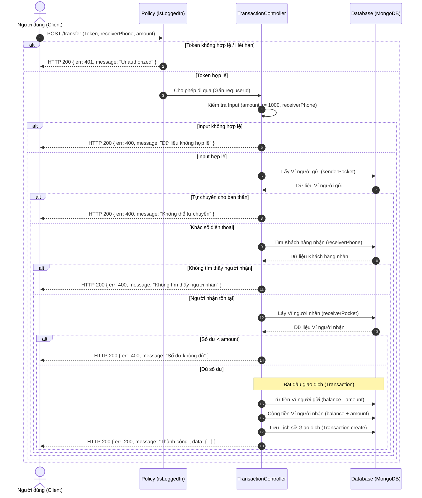

# Thiết kế Hệ thống Mini Wallet

## 1. [mini-mini-wallet] Sơ đồ Luồng Chuyển tiền P2P (Peer-to-Peer Transfer)
Sơ đồ dưới đây mô tả luồng nghiệp vụ khi một người dùng thực hiện chuyển tiền cho người dùng khác, đảm bảo tuân thủ các quy ước bảo mật và nghiệp vụ của dự án.

