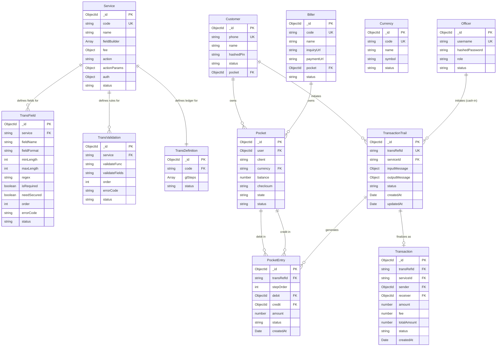

# ERD + Data Dictionary — Mini-Wallet Engine

> **Tài liệu này:** Thiết kế cơ sở dữ liệu chi tiết, bám sát `WEEK2-DESIGN-BRIEF.md` mục 5–6.  
> **Scope:** 3 nghiệp vụ (P2P / Cash-in / Bill Payment), 3 bước Engine (Request → Confirm → Verify).

---

## 1. ERD tổng quan (Entity Relationship Diagram)



---

## 2. Nhóm Config — Data Dictionary

> Khoá ngoại trên tất cả Config model = `String(service._id)`, **không phải** `service.code`.

### 2.1. `Service` — Định nghĩa nghiệp vụ

| Trường | Kiểu | Ràng buộc | Mô tả |
|--------|------|-----------|-------|
| `_id` | `ObjectId` | PK, auto | Khoá chính MongoDB |
| `code` | `String` | UNIQUE, NOT NULL | Mã định danh nghiệp vụ. VD: `"P2P"`, `"CASHIN"`, `"BILLPAYMENT"` |
| `name` | `String` | NOT NULL | Tên nghiệp vụ hiển thị. VD: `"Chuyển tiền P2P"` |
| `fieldBuilder` | `Array<Object>` | NOT NULL | Danh sách luật dựng biến. Xem schema con ở mục 2.1.1 |
| `fee` | `Object` | NOT NULL | Cấu hình phí. Xem schema con ở mục 2.1.2 |
| `action` | `String` | `none \| billerTrans` | Loại hành động tích hợp bên ngoài. `none` với P2P/Cash-in; `billerTrans` với Bill Payment |
| `actionParams` | `Object` | optional | Tham số cho `action`. VD: `{ "billerId": "<ObjectId>" }` với Bill Payment |
| `auth` | `Object` | NOT NULL | Cấu hình xác thực. Xem schema con ở mục 2.1.3 |
| `status` | `String` | `active \| inactive` | Trạng thái nghiệp vụ |

#### 2.1.1. Schema con: `fieldBuilder[]`

Mỗi phần tử trong mảng `fieldBuilder` là một **luật dựng biến** (dựng `transInput` từ request thô).

| Trường | Kiểu | Mô tả |
|--------|------|-------|
| `order` | `Number` | Thứ tự thực thi (thấp hơn chạy trước) |
| `name` | `String` | Tên biến sẽ đưa vào TRANSBODY. VD: `"AMOUNT"`, `"RECEIVERPHONE"` |
| `rule` | `String` | `fixed \| mapping \| query` |
| `source` | `String` | Tên nguồn dữ liệu (với `query`). VD: `"queryPocketByUserId"` |
| `variable` | `String` | Giá trị hằng (với `fixed`) hoặc đường dẫn field trong body (với `mapping`). VD: `"parameters.amount"` |
| `query` | `String` | Field cần lấy ra từ kết quả query (với `query`). VD: `"id"`, `"balance"` |
| `datatype` | `String` | `string \| number \| boolean` |
| `errorCode` | `String` | Mã lỗi trả về nếu dựng biến thất bại |

**Ba quy tắc `rule`:**

| `rule` | Ý nghĩa | Ví dụ |
|--------|---------|-------|
| `fixed` | Gán hằng số cứng | `CURRENCY = "VND"` |
| `mapping` | Lấy trực tiếp từ request body | `AMOUNT = parameters.amount` |
| `query` | Tra DB rồi lấy một field cụ thể | `SENDERID = queryPocketByUserId(USERID).id` |

#### 2.1.2. Schema con: `fee`

| `type` | Công thức | Ví dụ cấu hình |
|--------|-----------|----------------|
| `fixed` | `DEBITFEE = value` | `{ type: "fixed", value: 1000 }` |
| `percent` | `DEBITFEE = min(AMOUNT * value/100, max)` | `{ type: "percent", value: 0.5, max: 5000 }` |
| `none` | `DEBITFEE = 0` | `{ type: "none" }` |

> Phí luôn chảy về **ví System** (xem `glSteps`).

#### 2.1.3. Schema con: `auth`

| `method` | Nghĩa | Áp dụng |
|----------|-------|---------|
| `PIN` | Yêu cầu khách nhập PIN ở Bước 3 | P2P, Bill Payment |
| `NONE` | Bỏ qua xác thực (Bước 2 trả về ngay, Bước 3 không cần PIN) | Cash-in (Officer) |

---

### 2.2. `TransField` — Khai báo và validate định dạng biến

> Mỗi biến muốn xuất hiện trong `TRANSBODY` **bắt buộc phải có một dòng TransField**.  
> ⚠️ **Bắt buộc:** Luôn phải có dòng `SERVICEID` cho mỗi Service.

| Trường | Kiểu | Ràng buộc | Mô tả |
|--------|------|-----------|-------|
| `_id` | `ObjectId` | PK, auto | Khoá chính |
| `service` | `String` | FK → `String(Service._id)`, NOT NULL | Liên kết với nghiệp vụ |
| `fieldName` | `String` | NOT NULL | Tên biến trong TRANSBODY. VD: `"AMOUNT"`, `"SERVICEID"` |
| `fieldFormat` | `String` | `string \| number \| boolean` | Kiểu dữ liệu bắt buộc |
| `minLength` | `Number` | optional | Độ dài tối thiểu (dùng cho String) |
| `maxLength` | `Number` | optional | Độ dài tối đa (dùng cho String) |
| `regex` | `String` | optional | Biểu thức chính quy để validate. VD: `"^[0-9]{10}$"` |
| `isRequired` | `Boolean` | default `true` | Có bắt buộc phải tồn tại không |
| `needSecured` | `Boolean` | default `false` | Có cần che giấu khi log không (VD: PIN) |
| `order` | `Number` | NOT NULL | Thứ tự validate |
| `errorCode` | `String` | NOT NULL | Mã lỗi khi validate thất bại |
| `status` | `String` | `active \| inactive` | Trạng thái |

---

### 2.3. `TransValidation` — Khai báo luật kiểm tra nghiệp vụ

| Trường | Kiểu | Ràng buộc | Mô tả |
|--------|------|-----------|-------|
| `_id` | `ObjectId` | PK, auto | Khoá chính |
| `service` | `String` | FK → `String(Service._id)`, NOT NULL | Liên kết với nghiệp vụ |
| `validateFunc` | `String` | NOT NULL | Tên hàm validator sẽ được gọi. VD: `"validateSenderAccountSufficiency"` |
| `validateFields` | `String` | NOT NULL | Danh sách tên biến truyền vào hàm, phân cách bởi `":"`. VD: `"SENDERID:AMOUNT:DEBITFEE"` |
| `order` | `Number` | NOT NULL | Thứ tự thực thi (thấp hơn chạy trước) |
| `errorCode` | `String` | NOT NULL | Mã lỗi trả về khi validate thất bại |
| `status` | `String` | `active \| inactive` | Trạng thái |

**Danh sách validator mini-wallet:**

| `validateFunc` | `validateFields` | Ý nghĩa |
|----------------|-----------------|---------|
| `validateReceiverIsNotSender` | `SENDERID:RECEIVERID` | Đảm bảo người gửi ≠ người nhận |
| `validateSenderAccountSufficiency` | `SENDERID:AMOUNT:DEBITFEE` | Kiểm tra `balance ≥ AMOUNT + DEBITFEE` |
| `validateSenderChecksum` | `SENDERID` | Kiểm tra checksum ví gửi không bị sửa tay |
| `validateReceiverChecksum` | `RECEIVERID` | Kiểm tra checksum ví nhận không bị sửa tay |

---

### 2.4. `TransDefinition` — Kịch bản ghi sổ kép (Double-Entry Ledger)

| Trường | Kiểu | Ràng buộc | Mô tả |
|--------|------|-----------|-------|
| `_id` | `ObjectId` | PK, auto | Khoá chính |
| `code` | `String` | FK → `String(Service._id)`, NOT NULL, UNIQUE | Liên kết 1-1 với Service |
| `glSteps` | `Array<Object>` | NOT NULL | Kịch bản các bước chuyển tiền. Xem schema con bên dưới |
| `status` | `String` | `active \| inactive` | Trạng thái |

#### Schema con: `glSteps[]`

Mỗi step là một bút toán kép: **debit** (trừ) một ví, **credit** (cộng) một ví khác.  
Bất biến: **Tổng debit = Tổng credit** ở mỗi nghiệp vụ.

| Trường | Kiểu | Mô tả |
|--------|------|-------|
| `order` | `Number` | Thứ tự thực thi step (bắt đầu từ 0) |
| `amount` | `String` | Tên biến TRANSBODY dùng làm số tiền. VD: `"AMOUNT"`, `"DEBITFEE"` |
| `debit` | `Object` | Ví bị trừ tiền: `{ level, target }` |
| `credit` | `Object` | Ví được cộng tiền: `{ level, target }` |

**Hai loại `level` trong `debit`/`credit`:**

| `level` | `target` | Ý nghĩa |
|---------|---------|---------|
| `productLevel` | `"SENDERID"` hoặc `"RECEIVERID"` | Ví động — tra theo biến trong TRANSBODY |
| `wallet` | `"<PocketId cố định>"` | Ví tĩnh — System, Bank (tra bằng ID cứng) |

> **Bỏ step có `amount == 0`** (ví dụ phí = 0 thì bỏ step phí, đừng insert bút toán 0đ).

---

## 3. Nhóm Runtime & Sổ sách — Data Dictionary

### 3.1. `TransactionTrail` — Hồ sơ giao dịch

> Sống xuyên suốt qua cả 3 bước. Là "hồ sơ bệnh án" của một giao dịch.

| Trường | Kiểu | Ràng buộc | Mô tả |
|--------|------|-----------|-------|
| `_id` | `ObjectId` | PK, auto | Khoá chính, **chính là `transRefId`** |
| `serviceId` | `String` | FK → `Service._id`, NOT NULL | Nghiệp vụ đang được thực thi |
| `inputMessage` | `Object` | NOT NULL | Snapshot toàn bộ input thô từ Client |
| `outputMessage` | `Object` | NOT NULL | Dữ liệu đã xử lý bao gồm `TRANSBODY` (danh sách các biến đã dựng) |
| `status` | `String` | `init \| pending \| done \| failed` | Vòng đời: `init` → `pending` (Request xong) → `done`/`failed` (Verify xong) |
| `createdAt` | `Date` | auto | Thời điểm tạo |
| `updatedAt` | `Date` | auto | Thời điểm cập nhật gần nhất |

**Vòng đời `status`:**

```
init  →  pending  →  done
                 ↘  failed
```

| Trạng thái | Khi nào | Tiền có chạy không |
|-----------|---------|-------------------|
| `init` | Vừa tạo Trail ở Request (trước validate) | Không |
| `pending` | Request hoàn tất validate thành công | Không |
| `done` | Verify hoàn tất, tiền đã ghi sổ | **Có** |
| `failed` | Bất kỳ lỗi nào trong Verify | Không (rollback) |

---

### 3.2. `Transaction` — Biên lai giao dịch

> Chỉ được tạo duy nhất **1 lần**, ở bước Verify thành công, trong `session.withTransaction`.

| Trường | Kiểu | Ràng buộc | Mô tả |
|--------|------|-----------|-------|
| `_id` | `ObjectId` | PK, auto | Khoá chính |
| `transRefId` | `String` | FK → `TransactionTrail._id`, NOT NULL | Mã tham chiếu, dùng cho idempotency |
| `serviceId` | `String` | FK → `Service._id`, NOT NULL | Nghiệp vụ |
| `sender` | `ObjectId` | FK → `Pocket._id`, NOT NULL | Ví gửi chính |
| `receiver` | `ObjectId` | FK → `Pocket._id`, NOT NULL | Ví nhận chính |
| `amount` | `Number` | NOT NULL, ≥ 0 | Số tiền gốc |
| `fee` | `Number` | NOT NULL, ≥ 0 | Phí giao dịch |
| `totalAmount` | `Number` | NOT NULL | `amount + fee` |
| `status` | `String` | `done \| failed` | Kết quả |
| `createdAt` | `Date` | auto | Thời điểm hoàn tất |

---

### 3.3. `Pocket` — Ví tiền

> Mỗi chủ thể (Customer, Biller, System, Bank) có ít nhất **1 Pocket** mỗi loại tiền tệ.

| Trường | Kiểu | Ràng buộc | Mô tả |
|--------|------|-----------|-------|
| `_id` | `ObjectId` | PK, auto | Khoá chính (= `SENDERID` / `RECEIVERID` trong config) |
| `user` | `ObjectId` | FK → `Customer._id \| Officer._id \| Biller._id`, NOT NULL | Chủ ví |
| `client` | `String` | `customer \| biller \| system \| bank` | Loại chủ thể sở hữu |
| `currency` | `String` | FK → `Currency.code`, NOT NULL | Đơn vị tiền tệ |
| `balance` | `Number` | NOT NULL, ≥ 0 | Số dư hiện tại |
| `checksum` | `String` | NOT NULL | MD5 hash `(balance + user + ...)` để chống sửa tay trực tiếp trong DB |
| `state` | `String` | `idle \| inProgress` | Trạng thái khoá: `inProgress` = đang có giao dịch, chống race condition |
| `status` | `String` | `active \| frozen \| closed` | Trạng thái hoạt động của ví |

**Cơ chế `checksum`:**
- Sau mỗi thao tác `debit`/`credit`, hệ thống tính lại `checksum = md5(balance + userId + ...)`.
- Bước Verify sẽ kiểm tra checksum trước khi ghi sổ. Checksum không khớp → từ chối giao dịch.

**Cơ chế `state` (Anti Race-Condition):**
```
Bước 7.1 (Verify): SET state = 'inProgress'   ← Khoá
   ... thực hiện giao dịch ...
Bước 7.7 (Verify): SET state = 'idle'          ← Mở khoá (MỌI LỐI RA đều phải mở khoá)
```

---

### 3.4. `PocketEntry` — Bút toán sổ cái

> Ghi lại **từng dòng tiền** của mỗi `glStep`. Dùng để audit, reconcile.

| Trường | Kiểu | Ràng buộc | Mô tả |
|--------|------|-----------|-------|
| `_id` | `ObjectId` | PK, auto | Khoá chính |
| `transRefId` | `String` | FK → `TransactionTrail._id`, NOT NULL | Mã tham chiếu giao dịch |
| `stepOrder` | `Number` | NOT NULL | Thứ tự glStep tương ứng (0, 1, ...) |
| `debit` | `ObjectId` | FK → `Pocket._id`, NOT NULL | Ví bị trừ tiền |
| `credit` | `ObjectId` | FK → `Pocket._id`, NOT NULL | Ví được cộng tiền |
| `amount` | `Number` | NOT NULL, > 0 | Số tiền bút toán |
| `status` | `String` | `settled` | Luôn là `settled` (đã cam kết trong transaction ACID) |
| `createdAt` | `Date` | auto | Thời điểm tạo |

---

## 4. Nhóm Danh tính — Data Dictionary

### 4.1. `Customer` — Khách hàng cá nhân

| Trường | Kiểu | Ràng buộc | Mô tả |
|--------|------|-----------|-------|
| `_id` | `ObjectId` | PK, auto | Khoá chính |
| `phone` | `String` | UNIQUE, NOT NULL | Số điện thoại — dùng làm username đăng nhập và định danh |
| `name` | `String` | NOT NULL | Họ tên đầy đủ |
| `hashedPin` | `String` | NOT NULL | PIN đã băm (bcrypt), dùng để xác thực ở Bước 3 |
| `pocket` | `ObjectId` | FK → `Pocket._id` | Tham chiếu ví chính của khách hàng |
| `status` | `String` | `active \| locked \| closed` | Trạng thái tài khoản |

---

### 4.2. `Officer` — Quản trị viên / Nhân viên thu ngân

| Trường | Kiểu | Ràng buộc | Mô tả |
|--------|------|-----------|-------|
| `_id` | `ObjectId` | PK, auto | Khoá chính |
| `username` | `String` | UNIQUE, NOT NULL | Tên đăng nhập |
| `hashedPassword` | `String` | NOT NULL | Mật khẩu đã băm (bcrypt) |
| `role` | `String` | `admin \| cashier` | Phân quyền: `admin` quản lý config, `cashier` thực hiện Cash-in |
| `status` | `String` | `active \| locked` | Trạng thái tài khoản |

---

### 4.3. `Biller` — Nhà cung cấp hoá đơn

| Trường | Kiểu | Ràng buộc | Mô tả |
|--------|------|-----------|-------|
| `_id` | `ObjectId` | PK, auto | Khoá chính, dùng trong `Service.actionParams.billerId` |
| `code` | `String` | UNIQUE, NOT NULL | Mã định danh. VD: `"EVN_HCM"` |
| `name` | `String` | NOT NULL | Tên hiển thị. VD: `"Điện lực TP.HCM"` |
| `inquiryUrl` | `String` | NOT NULL | URL API để tra cứu hoá đơn (gọi ở Request Bước 3.1) |
| `paymentUrl` | `String` | NOT NULL | URL API để xác nhận thanh toán (gọi ở Verify Bước 5.1) |
| `pocket` | `ObjectId` | FK → `Pocket._id` | Ví nhận tiền của Biller |
| `status` | `String` | `active \| inactive` | Trạng thái hoạt động |

---

### 4.4. `Currency` — Đơn vị tiền tệ

| Trường | Kiểu | Ràng buộc | Mô tả |
|--------|------|-----------|-------|
| `_id` | `ObjectId` | PK, auto | Khoá chính |
| `code` | `String` | UNIQUE, NOT NULL | Mã ISO 4217. VD: `"VND"` |
| `name` | `String` | NOT NULL | Tên đầy đủ. VD: `"Việt Nam Đồng"` |
| `symbol` | `String` | NOT NULL | Ký hiệu. VD: `"₫"` |
| `status` | `String` | `active \| inactive` | Trạng thái |

---

## 5. Tổng hợp quan hệ giữa các nhóm

```
[IDENTITY]                     [CONFIG]                        [RUNTIME]
─────────────────────          ────────────────────────        ──────────────────────────────
Customer ──owns──► Pocket      Service ──has──► TransField     TransactionTrail
Biller   ──owns──► Pocket              ──has──► TransValidation  ├─ uses ──► Service (via serviceId)
Officer                                ──has──► TransDefinition  ├─ generates ──► PocketEntry
                                                └─ glSteps[]          │            ├─debit──► Pocket
                                                                      │            └─credit──► Pocket
                                                                      └─ finalizes ──► Transaction
                                                                                       ├──► Pocket (sender)
                                                                                       └──► Pocket (receiver)
```

**Luồng hoạt động cốt lõi:**
1. **Admin** tạo bộ Config (`Service` + `TransField` + `TransValidation` + `TransDefinition`).
2. **Customer/Officer** gọi API → `Transaction.js` đóng dấu TRANSTEP → `NeonMessage.js` xử lý.
3. **Request:** Đọc Config → dựng `transInput` → validate → tạo `TransactionTrail(status=pending)`.
4. **Confirm:** Đọc Trail → trả `authMethod`.
5. **Verify:** Đọc Trail → khoá Pocket → xác thực → đọc `glSteps` → chạy ACID transaction → ghi `PocketEntry` + `Transaction` + lật Trail `done` → mở khoá Pocket.

---

*Tài liệu bám sát `WEEK2-DESIGN-BRIEF.md` mục 5 (Năm khối config) và mục 6 (Sổ sách + ExecuteTransaction). Khoá ngoại Config = `String(service._id)` theo cạm bẫy #2 (mục 9 Brief).*
