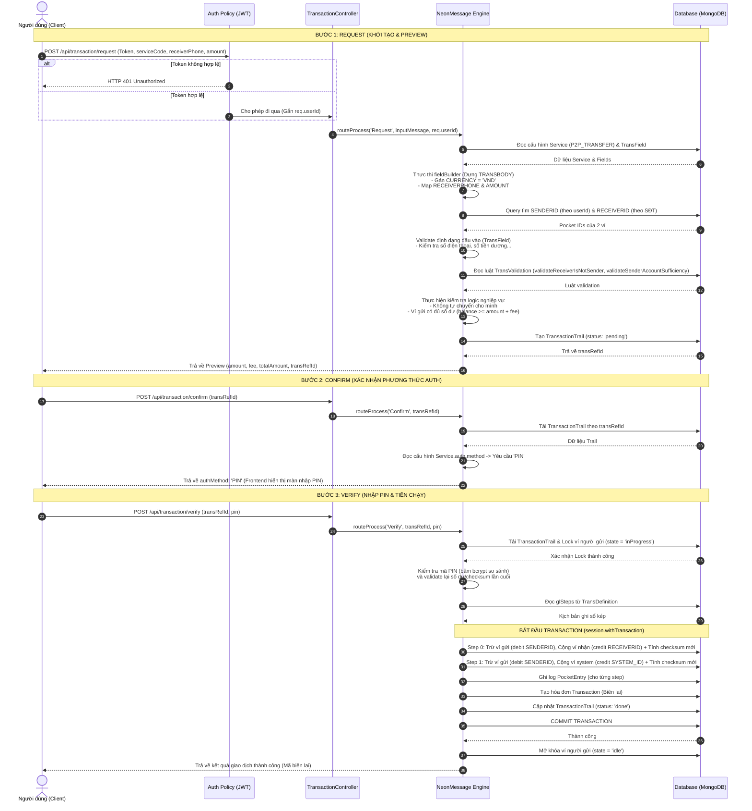
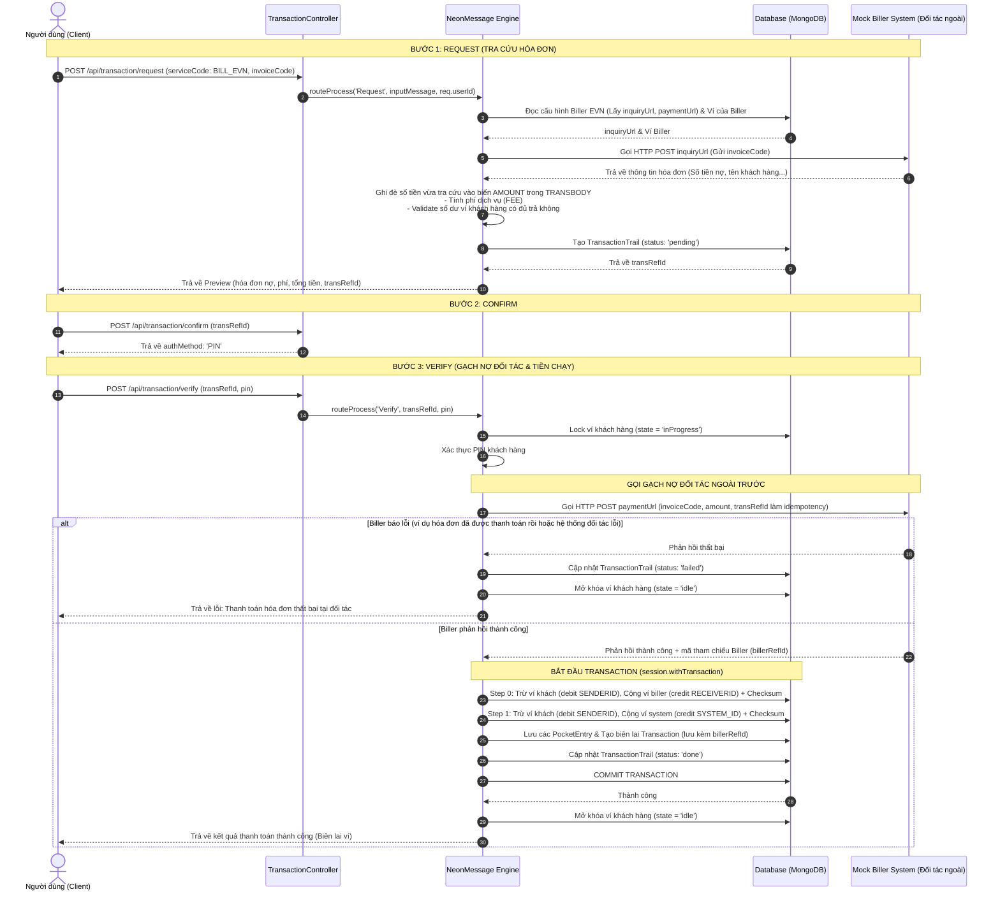
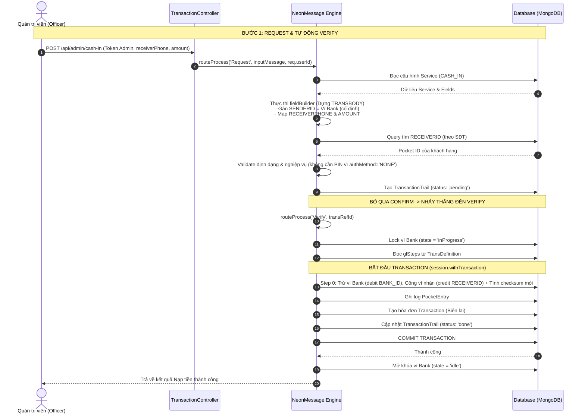
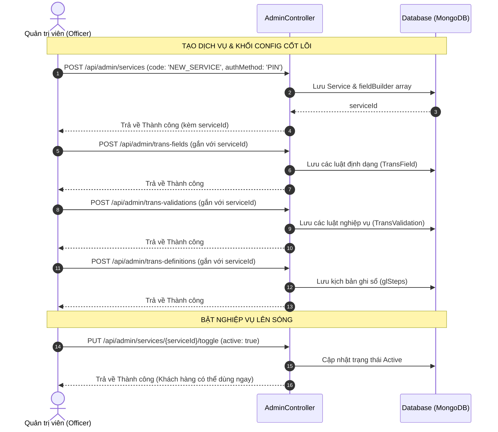
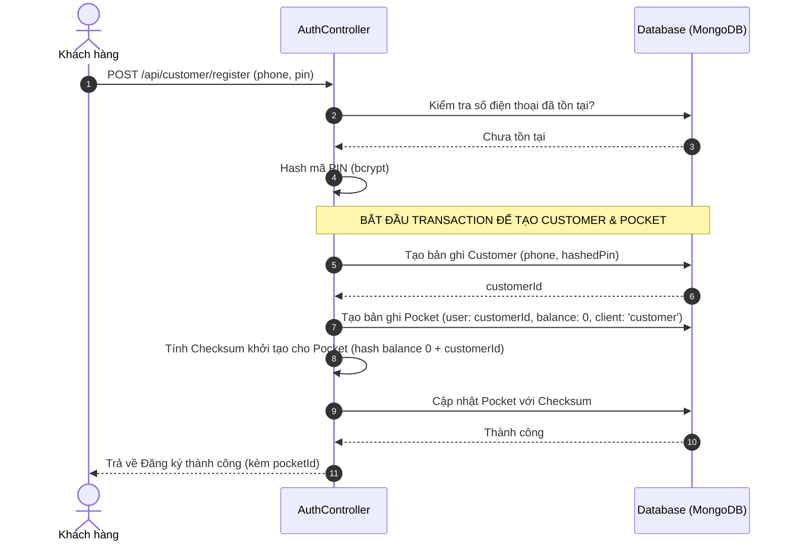
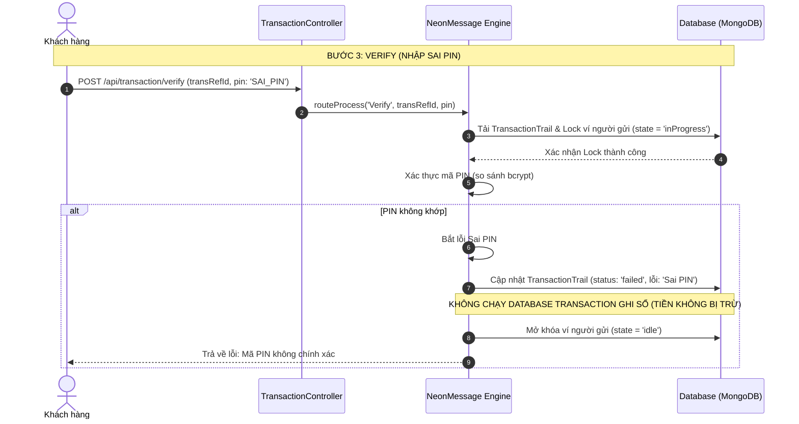

# 🔄 Sequence Diagrams — Mini-Wallet Engine (Tuần 2)

Tài liệu này cung cấp các sơ đồ tuần tự (Sequence Diagrams) chi tiết mô tả luồng đi của dữ liệu qua 3 bước (Request -> Confirm -> Verify) cho hai nghiệp vụ tiêu biểu: **P2P Transfer** và **Bill Payment**, cùng với các luồng vận hành hệ thống bổ sung để hiểu rõ kiến trúc.

---

## 1. Nghiệp vụ 1: Luồng P2P Transfer (Đủ 3 bước)

Sơ đồ dưới đây mô tả chi tiết quá trình chuyển tiền cá nhân, từ lúc dựng biến ở Request đến xác thực PIN ở Confirm và thực thi ghi sổ kép nguyên tử trong Session ở Verify.

---

## 2. Nghiệp vụ 3: Luồng Bill Payment (Có Tích hợp Hệ thống Ngoài)

Hóa đơn có đặc thù là **Khách hàng không tự nhập số tiền**. Hệ thống phải gọi API Inquiry của đối tác (Biller) ở bước Request để lấy số tiền nợ, và gọi API Payment của đối tác ở bước Verify để gạch nợ trước khi đổi số dư.

---

## 3. Nghiệp vụ 2: Luồng Cash-in (Nạp tiền bởi Officer)

Đây là luồng đặc biệt mô phỏng việc Nạp tiền. Khác với P2P, luồng này do **Admin/Officer khởi tạo**, bỏ qua bước Confirm và tự động kích hoạt Verify để chuyển tiền từ Ví Bank (ngân hàng giả lập) sang Ví Khách hàng.

---

## 4. Luồng Design-time: Cấu hình Hệ thống (Admin)

Sơ đồ này giải thích **Config-driven** hoạt động như thế nào ở phía quản trị. Nó cho thấy cách Officer định nghĩa một Dịch vụ mới mà không cần can thiệp vào Source Code.

---

## 5. Luồng Đăng ký & Sinh Ví (Customer Onboarding)

Sơ đồ này làm rõ cơ chế "Tự động sinh Ví" khi có khách hàng mới đăng ký tài khoản. Hệ thống bắt buộc phải tính Checksum ngay từ khi số dư bằng 0.

---

## 6. Luồng Lỗi & Rollback (ACID) - Ví dụ: Sai mã PIN

Sơ đồ này cho thấy sự an toàn của hệ thống khi quá trình giao dịch (Verify) gặp sự cố. Tiền sẽ không bị di chuyển và Ví vẫn được mở khóa để thực hiện lại giao dịch.

