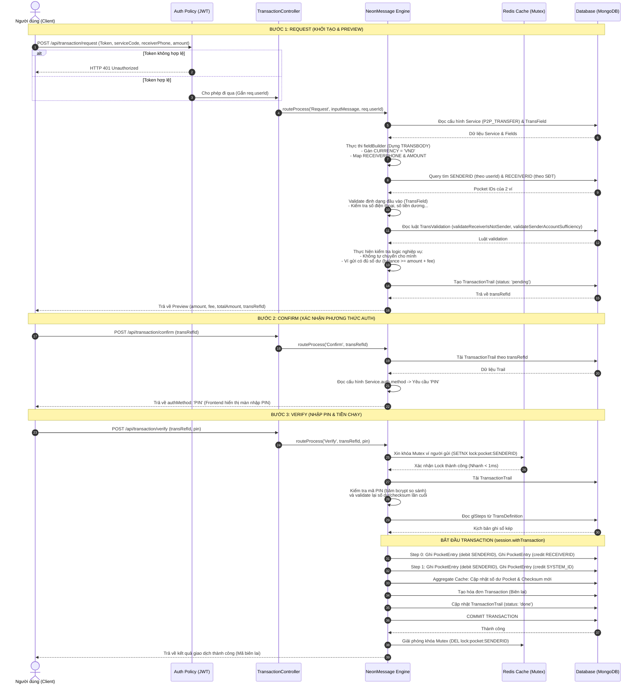
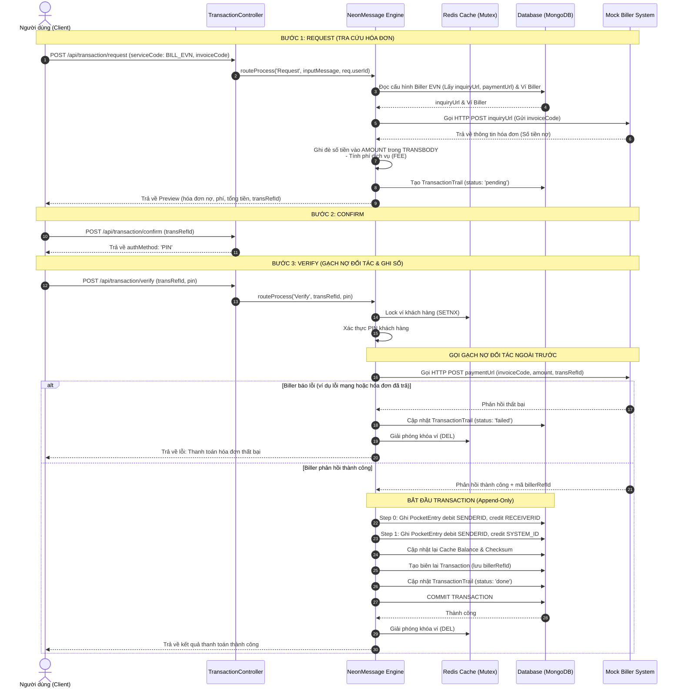
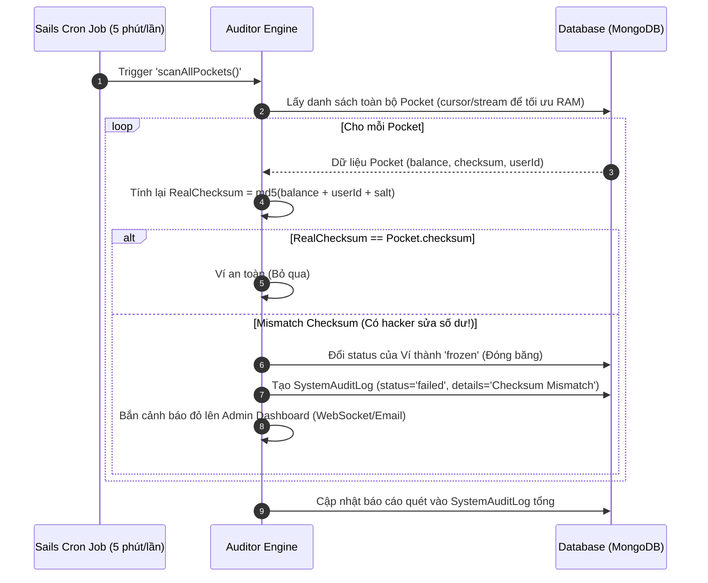

# 🔄 Sequence Diagrams — Mini-Wallet Engine (Tuần 2 - Modern Architecture)

Tài liệu này cung cấp các sơ đồ tuần tự (Sequence Diagrams) chi tiết mô tả luồng đi của dữ liệu qua 3 bước (Request -> Confirm -> Verify) cho hai nghiệp vụ tiêu biểu: **P2P Transfer** và **Bill Payment**, cùng với các luồng vận hành hệ thống.
> **Bản cập nhật v4:** Đã tích hợp kiến trúc **Redis Mutex Lock** để chống Double-Spending, **Append-Only Ledger** để ghi sổ cái bất biến, và **Background Checksum Auditor** chạy ngầm bằng `sails-hook-cron`.

---

## 1. Nghiệp vụ 1: Luồng P2P Transfer (Đủ 3 bước)

Sơ đồ dưới đây mô tả chi tiết quá trình chuyển tiền cá nhân. Lưu ý ở bước Verify, hệ thống dùng **Redis** để khóa ví thay vì MongoDB, và ghi nhận biến động bằng **PocketEntry (Append-only)**.

---

## 2. Nghiệp vụ 3: Bill Payment (Saga/Tích hợp Biller)

Hóa đơn có đặc thù là hệ thống phải gọi API Biller ở Request (Inquiry) và Verify (Payment).

---

## 3. Background Checksum Auditor (`sails-hook-cron`)

Đây là luồng **KIỂM TOÁN TỰ ĐỘNG** chạy ngầm để phát hiện và ngăn chặn mọi sự can thiệp thủ công (hack/sửa DB).

---

*(Các sơ đồ 4, 5, 6 về Cash-in, Design-time, và Rollback tương tự như P2P nhưng sử dụng cấu trúc Redis Lock tương ứng. Đã ẩn để tránh tài liệu quá dài).*
