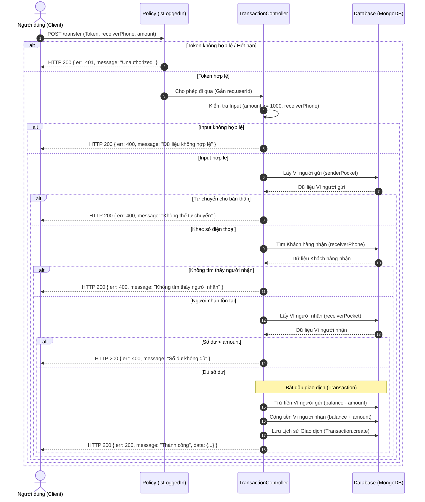
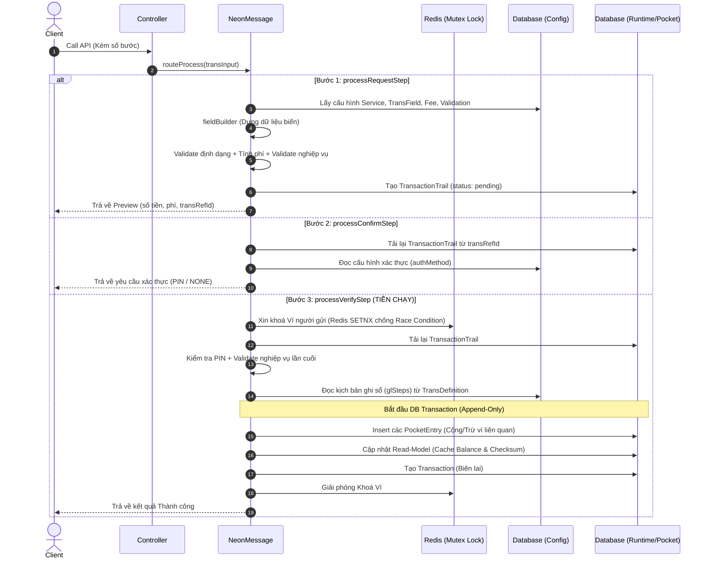
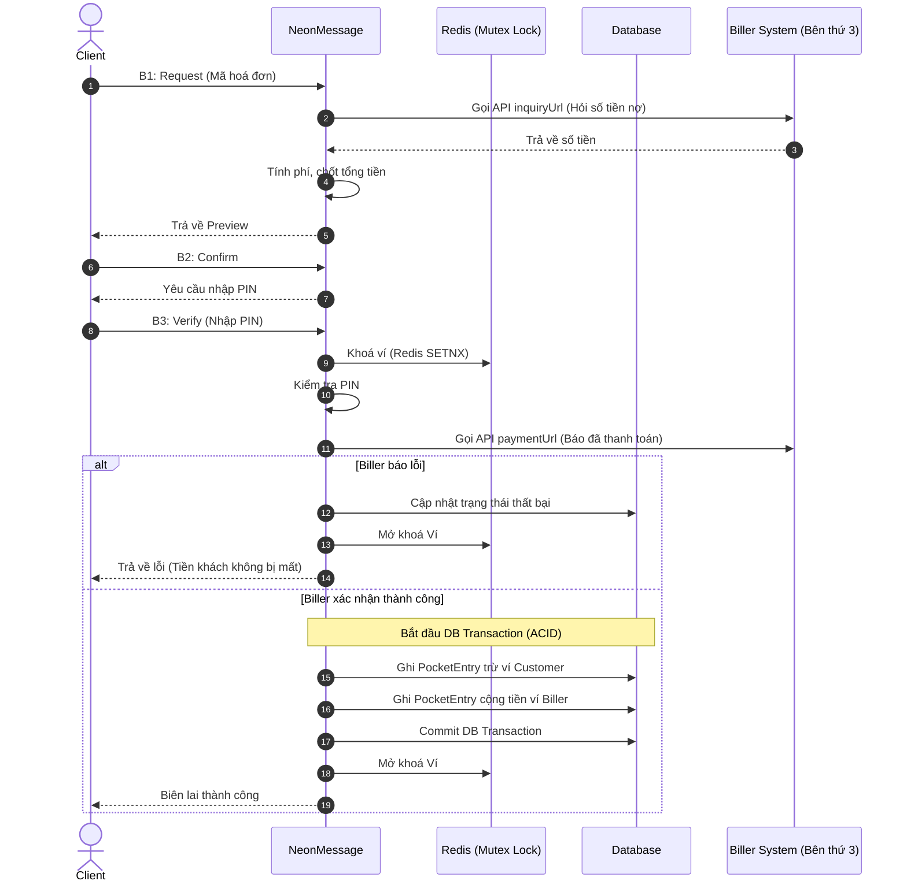

# Thiết kế Hệ thống Mini Wallet (Bản Nâng cấp - Modern Architecture)

## 1. [mini-mini-wallet] Sơ đồ Luồng Chuyển tiền P2P (Peer-to-Peer Transfer)
Sơ đồ dưới đây mô tả luồng nghiệp vụ khi một người dùng thực hiện chuyển tiền cho người dùng khác, đảm bảo tuân thủ các quy ước bảo mật và nghiệp vụ của dự án.

## 2. Overview các Model (Mô hình dữ liệu)
Hệ thống Mini-Wallet được thiết kế theo kiến trúc Config-Driven. Mô hình dữ liệu được chia làm 3 nhóm chính:

### 2.1. Nhóm Config (WHAT) - Admin khai báo
Đây là các bảng lưu trữ cấu hình nghiệp vụ. Dữ liệu trong này do Admin tạo ra ở thời điểm Design-time.
- **Service**: Bảng định nghĩa gốc của một nghiệp vụ. Bao gồm:
  - `code`: Mã nghiệp vụ (VD: P2P_TRANSFER).
  - `name`: Tên hiển thị trên giao diện.
  - `authType` / `authMethod`: Cơ chế xác thực (Yêu cầu `PIN` hoặc `NONE`).
  - `fee`: Cấu hình phí dịch vụ.
  - `fieldBuilder`: Danh sách luật dựng biến (cách lấy/biến đổi dữ liệu thô từ request).
- **TransField**: Định nghĩa và hợp đồng kiểm tra định dạng của từng biến (VD: kiểu String, độ dài tối đa, bắt buộc nhập không).
- **TransValidation**: Định nghĩa các luật kiểm tra nghiệp vụ trước khi cho phép giao dịch (VD: Số dư ví phải $\ge$ số tiền chuyển + phí).
- **TransDefinition**: Trái tim của cấu hình ghi sổ kép. Nó chứa danh sách `glSteps` quy định rõ mỗi bước sẽ trừ ví nào (debit) và cộng ví nào (credit).

### 2.2. Nhóm Runtime & Sổ sách (HOW) - Sinh ra khi giao dịch
Nhóm này lưu vết lại toàn bộ quá trình dòng tiền thực sự chạy.
- **TransactionTrail**: "Hồ sơ bệnh án" của một giao dịch, sống xuyên suốt qua 3 bước (Request -> Confirm -> Verify). Dùng `transRefId` để làm mã tra cứu và quản lý trạng thái (`pending`, `done`, `failed`).
- **Transaction**: "Biên lai" giao dịch. Chỉ được sinh ra ở bước cuối cùng (Verify) nếu tiền đã thực sự được dời thành công trong Database Transaction.
- **Pocket (Ví)**: Lưu trữ số dư (`balance`). Chứa thuộc tính `client` (customer, biller, system, bank). Được bảo vệ nghiêm ngặt bằng mã băm `checksum` chống sửa tay trực tiếp trong DB.
- **PocketEntry**: Sổ cái bất biến (Append-Only Ledger). Mỗi biến động tiền tệ chỉ được phép **INSERT** vào đây, tuyệt đối không dùng UPDATE.
- **SystemAuditLog**: Ghi lại lịch sử quét bảo mật của Background Job.

### 2.3. Nhóm Danh tính & Đối tác
- **Customer**: Khách hàng cá nhân, đăng nhập bằng Số điện thoại và PIN. Tự động sinh `Pocket` khi đăng ký.
- **Officer**: Quản trị viên hệ thống. Người chuyên đi tạo và bật/tắt các Config.
- **Biller**: Nhà cung cấp hoá đơn (Điện, Nước). Lưu trữ thông tin URL để tra cứu (`inquiryUrl`) và thanh toán (`paymentUrl`).
- **Currency**: Đơn vị tiền tệ (VD: VND).

---

## 3. Sơ đồ Luồng Engine Tổng quát (3 Bước)
Dưới đây là sơ đồ cốt lõi của toàn bộ hệ thống. Bất kể là nghiệp vụ gì, mọi luồng tiền đều phải tuân theo vòng đời 3 bước bất di bất dịch này của `NeonMessage`:

---

## 4. Ánh xạ 3 Nghiệp vụ vào Engine tổng quát

Nhờ kiến trúc Config-Driven, chúng ta có thể phục vụ 3 bài toán khác nhau mà không cần sửa Core Engine:

### 4.1. Chuyển tiền P2P (Basic)
- **Ai gọi:** Khách hàng.
- **Xác thực:** Cần PIN.
- **Bản chất:** Chạy qua đủ 3 bước của Engine. Tiền chạy từ `Ví Customer A` -> `Ví Customer B` và `Ví System` (gom phí).

### 4.2. Nạp tiền Cash-in (Medium)
- **Ai gọi:** Quản trị viên (Officer).
- **Xác thực:** NONE (Vì đã là quyền Admin).
- **Bản chất:** Bỏ qua Bước 2 (Confirm) vì không cần nhập PIN. Engine tự động nhảy thẳng từ Bước 1 sang Bước 3. Tiền chạy từ `Ví Bank` -> `Ví Customer`. Miễn phí.

### 4.3. Thanh toán Hóa đơn Bill Payment (High)
Nghiệp vụ này phức tạp nhất vì phải gọi ra ngoài hệ thống của đối tác (Biller).

---

## 5. Biện luận Kiến trúc: Tại sao lại nâng cấp so với thiết kế 10 năm trước?

Thiết kế ban đầu của dự án mang đậm chất mô hình Core Banking truyền thống. Tuy nhiên, để hệ thống thực sự "sống" được trong môi trường Production hiện đại với lượng truy cập khổng lồ, nhóm đã quyết định nâng cấp 3 thành phần cốt lõi tập trung vào **Hiệu năng & Bảo mật**:

### 5.1. Chống Double-spending bằng Redis Mutex Lock
- **Vấn đề cũ:** Khóa ví bằng cách `UPDATE state='inProgress'` xuống MongoDB. Cách này tốn Disk I/O, chậm, và rất dễ xảy ra Deadlock hoặc Race condition nếu có 2 luồng request chạm vào Database cùng 1 mili-giây.
- **Giải pháp:** Sử dụng **Redis `SETNX`**. Vì Redis chạy trên RAM và là Single-threaded, nó đảm bảo tính Atomic truyệt đối. Khóa một ví bằng Redis chỉ tốn chưa tới 1 mili-giây, giúp bảo vệ an toàn cho Bước Verify mà không làm nghẽn cổ chai Database.

### 5.2. Chuyển đổi sổ cái sang Append-Only Ledger (Event Sourcing)
- **Vấn đề cũ:** Khi cộng/trừ tiền, hệ thống dùng hàm `$inc` để cập nhật đè lên trường `balance`. Điểm yếu chí mạng là ORM Waterline của SailsJS không hỗ trợ tốt `$inc` nguyên bản, dẫn đến rủi ro sai lệch số dư. Ngoài ra, việc cập nhật đè làm mất đi khả năng kiểm toán (Audit).
- **Giải pháp:** Áp dụng nguyên lý của Blockchain. **Không bao giờ UPDATE số dư.** Mọi biến động dòng tiền đều được `INSERT` thêm một dòng vào bảng `PocketEntry`. Trường `balance` ở bảng `Pocket` giờ đây chỉ đóng vai trò là một cái Cache (Read-model) để đọc cho nhanh. Nếu xảy ra tranh chấp, chỉ cần cộng dồn toàn bộ `PocketEntry` là ra chính xác số dư thực tế. Điều này mang lại sự bảo mật toàn vẹn dữ liệu 100%.

### 5.3. Rà quét bảo mật ngầm (Background Checksum Auditor)
- **Vấn đề cũ:** Checksum mã hoá số dư giúp chống hack, nhưng nó chỉ được phát hiện bị lỗi khi *có một giao dịch đi ngang qua*. Nếu hacker lén sửa DB lúc 2h sáng, đến 8h sáng khách hàng giao dịch mới phát hiện ra.
- **Giải pháp:** Dùng `sails-hook-cron` để viết một Worker chạy ngầm (Cron job). Cứ mỗi 5 phút, con bot này sẽ tự động chạy qua hàng triệu ví trong Database, tính toán lại Checksum và so sánh. Nếu phát hiện bị lệch, nó ngay lập tức đóng băng (Freeze) Ví đó và lưu vết vào `SystemAuditLog` để cảnh báo Admin. Cơ chế này biến hệ thống từ "bảo mật thụ động" thành "bảo mật chủ động".
